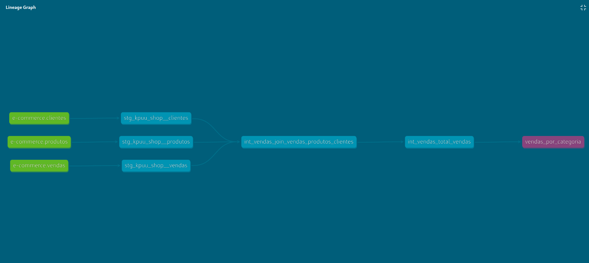
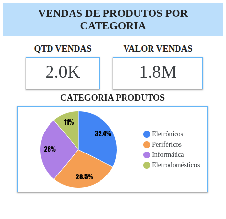

# DBT com BigQuery

## 👤 Autor

**Ricardo Marques**

---

## 📁 Estrutura do Projeto DBT

O projeto segue as melhores práticas de modelagem com **dbt**, utilizando as camadas:

- `staging/`: limpeza e padronização dos dados brutos.
- `intermediate/`: enriquecimento, integração e transformação dos dados.
- `marts/`: entrega analítica final para uso em dashboards e ferramentas de BI.

Essa arquitetura facilita manutenção, escalabilidade e organização das transformações.

---

## 🔧 Configuração do DBT com BigQuery

Este projeto utiliza **dbt** com o **Google BigQuery** como data warehouse.

### 🔐 Conexão via Conta de Serviço com Variáveis de Ambiente

A conexão foi feita por **conta de serviço**, com credenciais seguras por **variáveis de ambiente**:

```yaml
project: "{{ env_var('DBT_PROJECT') }}"
dataset: "{{ env_var('DBT_DATASET') }}"
keyfile: "{{ env_var('DBT_KEYFILE') }}"
```

Exemplo de export no ambiente:

```bash
export DBT_PROJECT=meu_projeto
export DBT_KEYFILE=/caminho/para/key.json
```

### 📁 Uso de Profile Customizado

O caminho do `profiles.yml` foi customizado com:

```bash
dbt run --profiles-dir ../
```

---

## 🧱 Uso do DBT Seed para Tabelas no BigQuery

### Finalidade

Utilizado para importar arquivos `.csv` de dados de referência ou estáticos.

### Estrutura

1. Os arquivos `.csv` ficam na pasta `seeds/`.
2. O comando de carga é:

```bash
dbt seed
```

3. O dbt cria as tabelas com base nos nomes dos arquivos.
4. Tipagem e configurações podem ser ajustadas no `dbt_project.yml`.

### Ilustração

<p align="center">
  
</p>

---

## 📏 Uso do SQLFluff no Projeto

### ✔️ Objetivo

- Verificar erros de sintaxe.
- Garantir padrão de formatação.
- Suportar sintaxe com Jinja (`{{ ref() }}`, `{{ source() }}`).

### 🔧 Configuração

Usando o templater `dbt` para interpretar corretamente os modelos SQL:

```bash
poetry run sqlfluff lint models/
```

Correções podem ser feitas com:

```bash
poetry run sqlfluff fix models/
```

---

## 🏗️ Transformações Realizadas (Staging → Intermediate → Marts)

### 📥 Staging

- Renomeação e padronização dos dados brutos.
- Modelos criados:
  - `stg_kpuu_shop__clientes`
  - `stg_kpuu_shop__vendas`
  - `stg_kpuu_shop__produtos`

### 🔄 Intermediate

- Integração de `clientes`, `vendas` e `produtos` com joins.
- Modelos:
  - `int_vendas_join_vendas_produtos_clientes`
  - `int_vendas_total_vendas` (campo calculado: `qtd_vendas * preco_produto`)

### 📊 Marts

- Métricas finais de análise.
- Modelo:
  - `mart_vendas_totais_por_cliente` com agregações de total de vendas por cliente.


  ## 📚 Documentação com dbt Docs

Este projeto também utiliza o **dbt Docs** para gerar, visualizar e explorar a documentação e linhagem dos modelos criados no projeto.

---

### ✨ Geração da Documentação

Para gerar a documentação completa do projeto (incluindo descrições, dependências e estrutura dos modelos), utilize o comando:

```bash
dbt docs generate
```
Esse comando cria um diretório target/ com os arquivos estáticos da documentação, que podem ser visualizados em qualquer navegador.

### 🔍 Servindo a Documentação Localmente
Para visualizar a documentação de forma interativa e navegar pela linhagem dos dados, utilize:

```bash

dbt docs serve
```
Esse comando inicia um servidor local e abre automaticamente o navegador com uma interface que permite:

Explorar cada modelo (nome, descrição, SQL utilizado).

Verificar a linhagem entre os modelos, mostrando quais modelos alimentam outros (ref()). Ex:.

<p align="center">
  
</p>

Acompanhar os sources (tabelas brutas), seeds e relações com modelos intermediate e marts.

Visualizar comentários/documentações inseridas no código com {{ doc(...) }} ou nos arquivos .yml.

### 🧭 Benefícios do dbt Docs

Transparência total no fluxo de dados.

Facilidade para novos membros entenderem o projeto.

Melhor colaboração entre engenharia e áreas de negócio.

Navegação visual entre tabelas e suas dependências (estilo DAG).

## 📊 Visualização de Dados com Looker Studio

Após a modelagem dos dados e construção dos modelos finais na camada `marts`, foi criado um **dashboard no Looker Studio** para visualizar os principais indicadores de vendas.

### 🎯 Objetivo do Dashboard

O objetivo da visualização é facilitar a análise e o acompanhamento dos dados transformados, permitindo uma leitura clara de métricas como:

- Total de vendas por cliente
- Total de vendas por categoria de produto
- Total de vendas por estado e por região
- Evolução das vendas ao longo do tempo

### 🔗 Fonte de Dados

O dashboard foi conectado diretamente à camada `marts` do projeto dbt no BigQuery, garantindo que os dados exibidos estejam atualizados e consistentes com o pipeline de transformação.

### ✅ Benefícios

- **Exploração interativa** dos dados por filtros dinâmicos (estado, cliente, categoria, etc.)
- **Apoio à tomada de decisão** baseada em dados confiáveis e bem modelados
- **Integração com o dbt**, assegurando rastreabilidade completa da origem dos dados


<p align="center">
  
</p>
