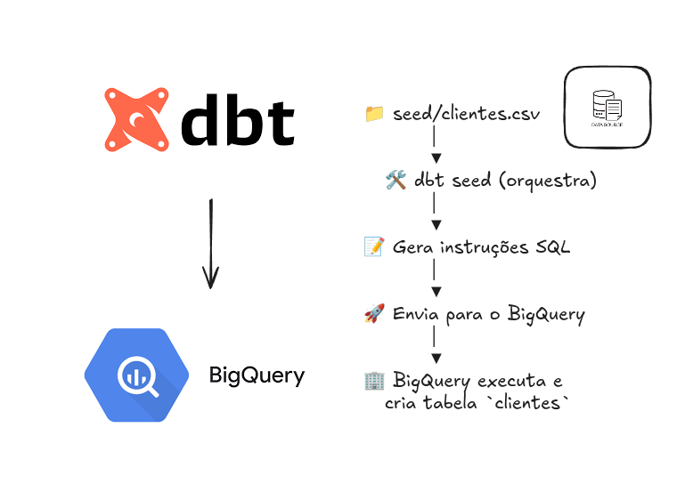

# DBT com Big Query

## Ricardo Marques

## 🔧 Configuração do dbt com BigQuery

Este projeto utiliza o **dbt** com o **Google BigQuery** como data warehouse.

### 📌 Conexão via Conta de Serviço com Variáveis de Ambiente

A conexão com o BigQuery foi configurada utilizando uma **conta de serviço**, com os dados sensíveis e de configuração extraídos por meio de **variáveis de ambiente**, garantindo maior segurança e flexibilidade.

O arquivo `profiles.yml` utiliza as variáveis da seguinte forma:

```yaml
datawarehouse:
  outputs:
    dev:
      type: bigquery
      method: "{{ env_var('DBT_METHOD') }}"
      project: "{{ env_var('DBT_PROJECT') }}"
      dataset: "{{ env_var('DBT_DATASET') }}"
      keyfile: "{{ env_var('DBT_KEYFILE') }}"
      threads: "{{ env_var('DBT_THREADS') | int }}"
      job_execution_timeout_seconds: "{{ env_var('DBT_JOB_TIMEOUT') | int }}"
      location: "{{ env_var('DBT_LOCATION') }}"
      priority: "{{ env_var('DBT_PRIORITY') }}"
      job_retries: "{{ env_var('DBT_JOB_RETRIES') | int }}"
  target: dev
```

📌 Definindo as Variáveis de Ambiente
Essas variáveis devem ser definidas em um arquivo .env ou exportadas no ambiente de execução, por exemplo:

```bash

export DBT_METHOD=service-account
export DBT_PROJECT=seu-projeto
export DBT_DATASET=seu_dataset
export DBT_KEYFILE=/caminho/para/sua-chave.json
export DBT_THREADS=1
export DBT_JOB_TIMEOUT=300
export DBT_LOCATION=US
export DBT_PRIORITY=interactive
export DBT_JOB_RETRIES=1
```
📁 Uso de Profile Customizado
O dbt foi configurado para utilizar um profiles.yml fora do diretório padrão, sendo o caminho especificado com a flag --profiles-dir:

```bash

dbt run --profiles-dir ../

```
## 🔧 Uso do dbt Seed para Criar Tabelas no BigQuery

No projeto, foi utilizado o comando **`dbt seed`** para criar tabelas no **BigQuery** a partir de arquivos CSV armazenados localmente. O **dbt seed** permite carregar dados diretamente para o BigQuery e é útil para importar dados de referência ou dados estáticos necessários para os modelos.


<p align="center">
  
</p>


### 📌 Configuração do dbt Seed

1. **Arquivos CSV**: Os arquivos CSV com os dados a serem carregados foram armazenados na pasta `seeds/` do projeto. Esses arquivos devem estar formatados corretamente para que o dbt consiga carregá-los no BigQuery.

2. **Comando dbt seed**: O comando `dbt seed` foi utilizado para carregar os arquivos para o BigQuery. O dbt automaticamente cria as tabelas e carrega os dados a partir dos arquivos CSV.

   O comando utilizado foi:

   ```bash
   dbt seed

   ```

3. **Estrutura das Tabelas:** Durante a execução do dbt seed, o dbt cria tabelas no BigQuery com o mesmo nome dos arquivos CSV, mas na schema e projeto configurados no profiles.yml.

4. **Configuração Adicional:** Caso haja necessidade de ajustes como a definição de tipos de dados ou configurações específicas de partição e clustering no BigQuery, esses parâmetros podem ser configurados diretamente no arquivo dbt_project.yml ou dentro do próprio arquivo profiles.yml.


### 🏗️ Estrutura do Projeto dbt

O projeto foi estruturado seguindo as melhores práticas de modelagem com **dbt**, utilizando os diretórios:

- **`staging/`**: onde são feitas as primeiras transformações e limpezas dos dados brutos vindos do BigQuery.
- **`intermediate/`**: camada intermediária onde os dados são integrados, enriquecidos e organizados para análises mais complexas.
- **`marts/`**: camada final orientada ao negócio, com tabelas e métricas preparadas para consumo analítico por ferramentas de BI ou dashboards.

Essa estrutura permite organizar as transformações de forma clara e escalável, separando responsabilidades e facilitando a manutenção.
A modelagem conduz os dados até o **mart analítico**, ponto final de entrega para **análises de negócio**.
